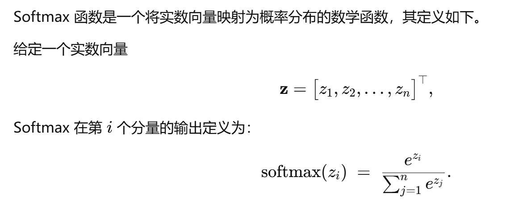

# part1
在开始下面的部分之前建议你先看一下我们准备的 前置知识.pdf ，里面对这一part涉及到的一些概念做了详尽说明

以下是你需要实现的内容：

### 矩阵类
元素类型为float，支持动态加载矩阵和确定矩阵大小，以及矩阵的乘法与加法，矩阵乘法使用常规的O(n^3)复杂度实现即可

### RELU函数
参数是一个矩阵，返回也是一个矩阵，对于这个矩阵的每一个元素，如果其大于0，则不变，如果小于0，则变为0。简单的说就是对矩阵的每一个元素和0取max

### SoftMax函数
输入是一个向量（你可以用行/列为一的矩阵做也可以用std::vector做），返回也是向量。

### model类
内部含有四个矩阵，为方便理解，假定这四个矩阵的长宽分别为
- weight1: 784 * 500
- bias1: 1 * 500
- weight2: 500 * 10
- bias2: 1 * 10

构造时传入这四个矩阵(在你完成part2之前就按照假定的矩阵长宽传入空白矩阵)

拥有forward方法，传入1 * 784的矩阵，返回长为10的向量  ///处理输入左值和右值的行为

先将输入矩阵和weight1做矩阵乘法，得到长宽为1 * 500的临时矩阵  ///输入矩阵行数为1

再和bias1做加法（逐元素相加），得到长宽为1 * 500的临时矩阵

经过relu函数，得到长宽为1 * 500的临时矩阵

再和weight2做矩阵乘法，得到1 * 10的临时矩阵

再和bias2做矩阵加法，得到1 * 10的矩阵

最后经过softmax函数，返回长为10的向量

用公式描述则是： softmax(relu(x * w1 + b1) * w2 + b2)

---
当你完成了上述的部分，恭喜你通过了新手村，接下来五部分你可以以任意顺序去完成，不过我建议你可以先做part2和part6，这样你才能知道你的这一部分里有没有bug，如果顺利的话，你就能得到和视频中展示的同款效果